## Kevin cuitiva - Juan Silva
# parte 1

- creacion del repositorio local y luego subir el documento reamde.md a github 

# parte 2

- se creo el repositorio compartido con el owner y el colaborador, luego intentamos subir el mismo
readme.md con cambios diferentes al mismo tiempo y mientras que al colaborador no le tiraba error
el owner recibia el siguiente error;

- al colaborador todo le salia correcto:

- la forma de solucionar esto era simplemente utilizar intellij como medio de modificacion para el repositorio
ya que el lo hace de forma automatica, ya que los errores que tenia el owner era por falta de hacer un pull
y descargar las actualizaciones del archivo.

# parte 3

- ¿Hay una mejor forma de trabajar con git para no tener conflictos?

hay cierto tipo de forma para trabajar de mejor forma en github, lo que podemos usar es crear ramas 
para que cada persona trabaje en una rama diferente. Adicionalmente se recomienda que que no se editen
los mismos archivos al mismo tiempo, pero que si hay que hacerlo que se coordine por seccines.

- ¿Qué es y como funciona el Pull Request?

el pull request es una solicitud de fusion en github, esta hace que los cambios dados por las personas 
tengan que ser aprobador antes de unirse a la rama principal, esto sirve para tener un control de calidad
y coordinacion en el equipo.

- creacion de ramas cada una:

- creacion del pull request:

- Test final:

## Retos

# Reto1
- Presentacion

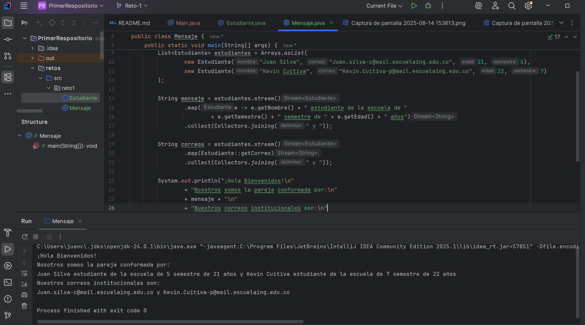

# Reto2

- carrera de ramas

- Carril1

-Carril2

# Reto3 

- builder 

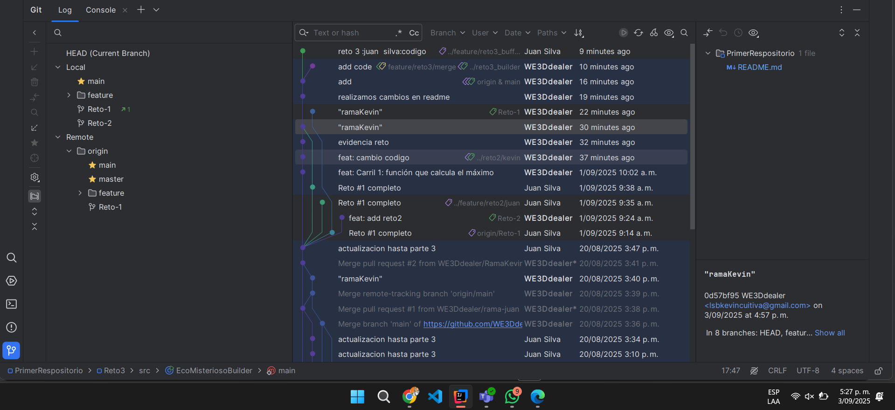

- buffer

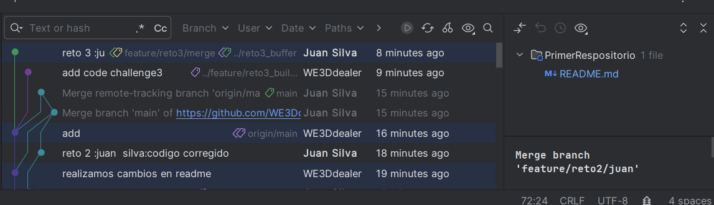

# Reto 4

- primer merge

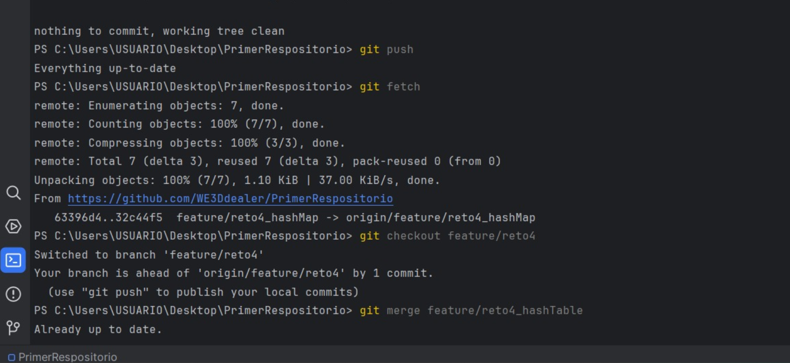

- segundo merge

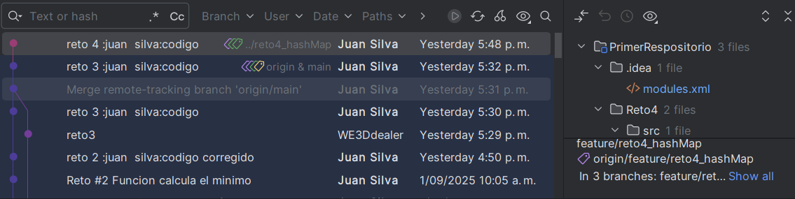

# Reto 5

- primer merge

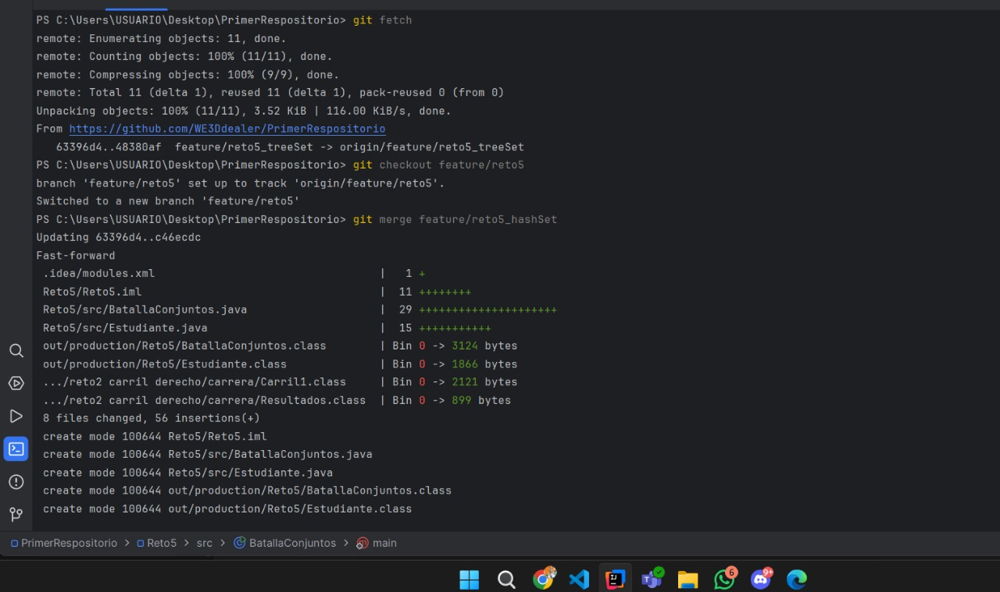

- segundo merge

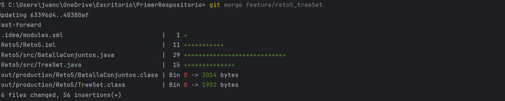

# Reto 6

- salidas 

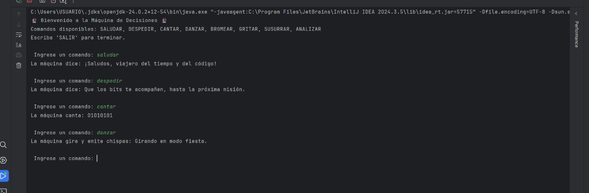

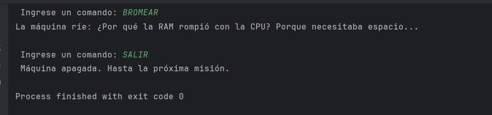

- merges 

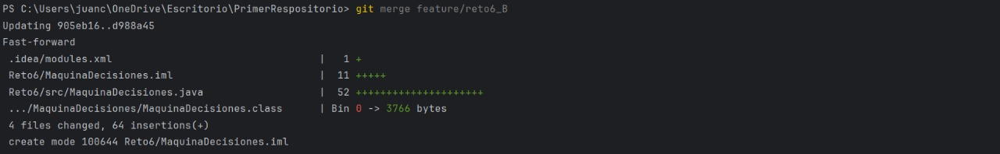

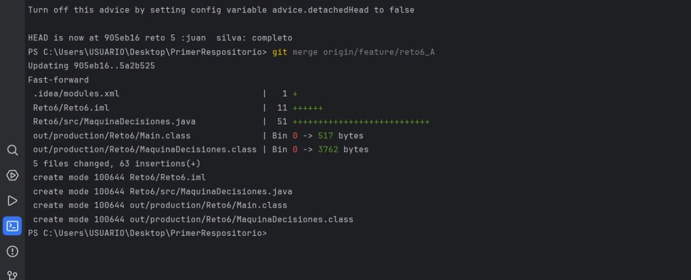

### Preguntas

- Cuál es la diferencia e	ntre git merge y git rebase

- Si dos ramas modifican la misma línea de un archivo ¿Qué sucede al hacer merge?

- ¿Cómo puedes ver gráficamente el historial de merges y ramas en consola?

- Explica la diferencia entre un commit y un push?

- Para que sirve git stash y git pop?

- Qué diferencia hay entre HashMap y HashTable?

- Qué ventajas tiene Collectors.toMap() frente a un bucle tradicional para llenar un mapa?

- Si usas List con objetos y luego aplicas stream().map() que tipo de operación estas haciendo?

- Que hace el método stream().filter() y que retorna?

- Describe el paso a paso de cómo crear una rama desde develop si es una funcionalidad nueva.

- ¿Cuál es la diferencia entre crear una rama con git branch y con git checkout -b?

- ¿Por qué es recomendable crear ramas feature/ para nuevas funcionalidades en lugar de trabajar en main directamente? 

 